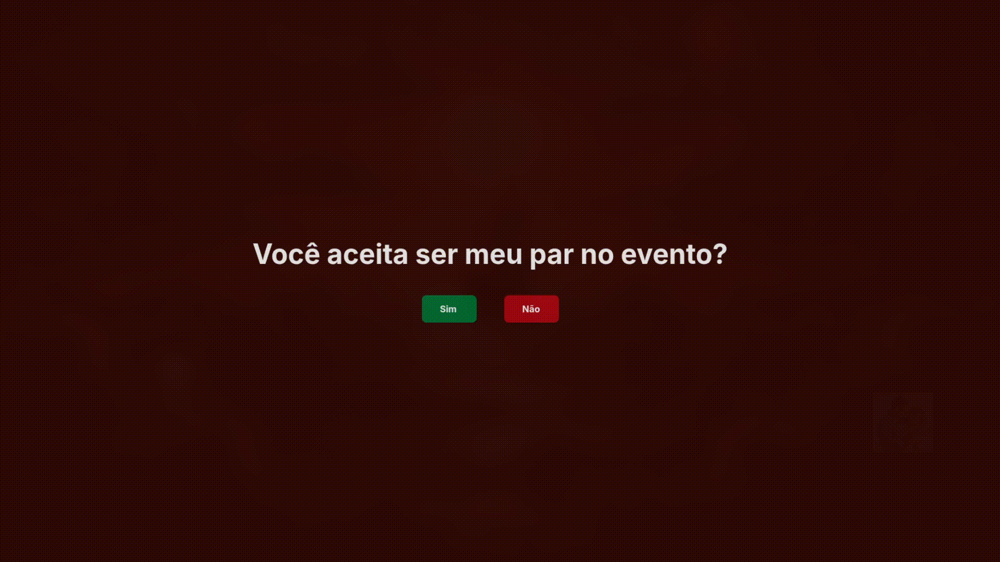

# 🎁 Modular Gift App

Este projeto é uma aplicação interativa e altamente personalizável para pedidos de namoro, convites ou mensagens especiais. O grande diferencial é sua **arquitetura modular**: você pode alterar fotos, vídeos, cores e textos sem mexer no código, apenas configurando pastas e variáveis de ambiente via Docker.

## 📷 Demonstrações

### Página de Pergunta (Question)
<div align="center">
  
</div>

### Página de Resposta (Response)
<div align="center">
  
</div>

---

## 🛠 Tecnologias

- **React + Vite**: Performance e processamento eficiente de assets.
- **TypeScript**: Segurança e tipagem para um código robusto.
- **Tailwind CSS**: Estilização dinâmica e responsiva.
- **Lucide React**: Ícones modernos e leves.
- **Docker & Docker Compose**: Containerização para deploy simplificado.

---

## 🧩 Modularidade e Customização

A aplicação separa o **motor (código)** do **conteúdo (suas mídias)**. Através de volumes do Docker, você injeta seus arquivos diretamente na estrutura do projeto.

### Como as mídias são carregadas:
- **Fotos de Fundo:** O sistema varre a pasta mapeada e gera o fundo flutuante automaticamente.
- **Mídia de Resposta:** Dependendo do tipo escolhido (`IMAGE` ou `VIDEO`), o container busca o arquivo na pasta correspondente.

> [!IMPORTANT]
> Para um guia passo a passo de como colocar suas próprias fotos e textos, veja o arquivo:  
> 📖 **[INSTRUCOES.md](./docs/INSTRUCOES.md)**

---

## 🌐 Variáveis de Ambiente

Personalize o comportamento da aplicação no seu `docker-compose.yml`:

| Variável | Descrição | Exemplo |
| :--- | :--- | :--- |
| `VITE_QUESTION` | Pergunta da primeira página. | Você aceita ser meu par no evento? |
| `VITE_RESPONSE_TEXT` | Título da página de sucesso. | Mal posso esperar por esse dia! |
| `VITE_RESPONSE_SUBTEXT` | Subtítulo da página de sucesso. | Aqui está seu presente |
| `VITE_RESPONSE_TYPE` | Tipo de resposta: `IMAGE`, `TEXT`, `CODE`, `VIDEO` ou `YOUTUBE`. | `VIDEO` |
| `VITE_RESPONSE_VALUE` | O que será exibido na página de resposta (texto, código, ou vídeo do youtube) | _{Codigo de Gift Card}_ |
| `VITE_BACKGROUND_COLOR` | Cor de fundo em Hexadecimal. | `#1a1a1a` |
| `VITE_YOUTUBE_URL` | Link da trilha sonora da página de resposta (YouTube). | `https://youtu.be/...` |
| `VITE_ONLY_DESKTOP` | Deve ou não bloquear a aplicação para dispositivos pequenos. | `false` |

---

## 🏁 Como Rodar Localmente

### 🏗 Via Docker Compose (Recomendado)

1. Certifique-se de ter o Docker e o Docker Compose instalados.

2. Crie um arquivo `docker-compose.yml` com o seguinte conteúdo:

```yaml
services:
  presente-app:
    image: joao1barbosa/modular-gift:latest
    container_name: modular-gift-app
    restart: unless-stopped
    ports:
      - "8080:4173"
    environment:
      - VITE_QUESTION=Você aceita ser meu par no evento?
      - VITE_RESPONSE_TEXT=Mal posso esperar por esse dia!
      - VITE_RESPONSE_SUBTEXT=Aqui está seu presente
      - VITE_RESPONSE_TYPE=VIDEO
      - VITE_RESPONSE_VALUE=
      - VITE_BACKGROUND_COLOR=#1a1a1a
      - VITE_YOUTUBE_URL=https://youtu.be/...
      - VITE_ONLY_DESKTOP=false
    volumes:
      - ./bg-photos:/app/src/assets/question/photos
      - ./res-file:/app/src/assets/response
```
3. Execute o comando:
```bash
  docker-compose up -d
```
### 🏃 Via Terminal (Docker Run)

```bash
  docker run -d -p 8080:4173 \
  -e VITE_QUESTION="Aceita o convite?" \
  -e VITE_QUESTION=Você aceita ser meu par no evento? \
  -e VITE_RESPONSE_TEXT=Mal posso esperar por esse dia! \
  -e VITE_RESPONSE_SUBTEXT=Aqui está seu presente \
  -e VITE_RESPONSE_TYPE=VIDEO \
  -e VITE_RESPONSE_VALUE= \
  -e VITE_BACKGROUND_COLOR=#1a1a1a \
  -e VITE_YOUTUBE_URL=https://youtu.be/... \
  -e VITE_ONLY_DESKTOP=false \
  -v $(pwd)/bg-photos:/app/src/assets/question/photos \
  -v $(pwd)/res-file:/app/src/assets/response \
  joao1barbosa/modular-gift:latest
```

## 🤝 Contribuição

Sinta-se à vontade para abrir Issues ou enviar Pull Requests!

